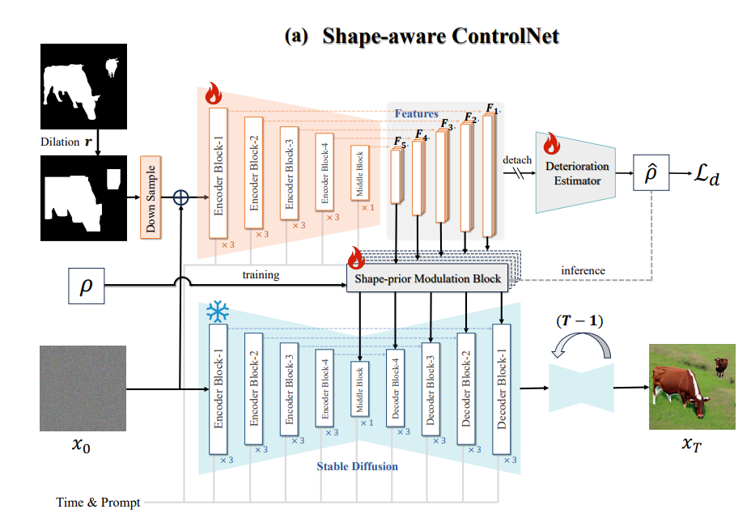
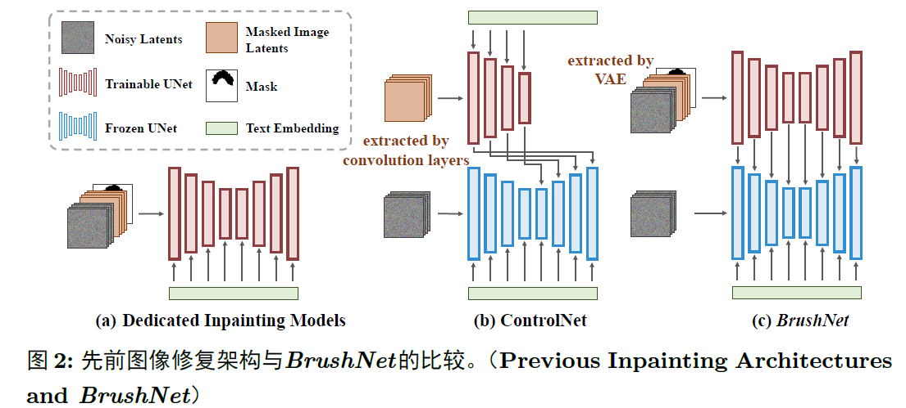

## Mask-Controlnet

基于mask条件的controlnet生成模型，基于海量电商抠图数据（显著图检测数据）训练。

 <p align="center">
      <a href='https://github.com/leeguandong/MaskControlnet'>
            
      </a>
      <a href='https://github.com/leeguandong/MaskControlnet'>
            
      </a>
      </br>
      <a href="https://github.com/leeguandong/MaskControlnet/graphs/contributors">
        
      </a>
      <a href="https://github.com/leeguandong/MaskControlnet/issues">
        
      </a>
      <a href="https://github.com/leeguandong/MaskControlnet/pulls">
        
      </a>
      <a href=href="https://github.com/leeguandong/MaskControlnet/stargazers">
        
      </a>
      <a href=href="https://github.com/leeguandong/MaskControlnet">
        
      </a>
      </br>
      <a href=href="https://github.com/leeguandong/MaskControlnet">
        
      </a>
      <a href=href="https://github.com/leeguandong/MaskControlnet">
        
      </a>
      <a href="https://github.com/leeguandong/MaskControlnet/blob/main/LICENSE">
        
      </a>
  </p>

## 本文贡献




- 借助海量电商场景的抠图数据，也就是显著图检测数据的0/1的mask图，训练一个有mask引导的controlnet模型，该模型能在电商场景有很好的生成。在https://blog.csdn.net/u012193416/article/details/142453416这篇博客中有更加详细的介绍。注意mask引导的controlnet和controlnet inpainting模型是不同的，我们其实也希望通过mask controlnet这种方式来解决模型的过度补全问题。我选了一个做法比较相似的mask controlnet和controlnet inpainting的结构图做对比。

## 数据集

- 抠图数据。


## 快速上手

### 1.安装环境
```bash
pip install diffusers
```
### 2.模型推理

|模型权重|下载链接|质量|
|:-|:-|:-|:-|
|checkpoints-MaskControlnet|/weights/|低|

#### CLI推理

```python
from diffusers import StableDiffusionControlNetPipeline, ControlNetModel, UniPCMultistepScheduler
from diffusers.utils import load_image
import torch

base_model_path = "/home/lgd/common/ComfyUI/models/checkpoints/stable-diffusion-v1.5-no-safetensor/"
controlnet_path = "/home/lgd/e_commerce_sd/outputs/mask_controlnet"

controlnet = ControlNetModel.from_pretrained(controlnet_path, torch_dtype=torch.float16)
pipe = StableDiffusionControlNetPipeline.from_pretrained(
    base_model_path, controlnet=controlnet, torch_dtype=torch.float16
)

# speed up diffusion process with faster scheduler and memory optimization
pipe.scheduler = UniPCMultistepScheduler.from_config(pipe.scheduler.config)
# remove following line if xformers is not installed or when using Torch 2.0.
pipe.enable_xformers_memory_efficient_attention()
# memory optimization.
pipe.enable_model_cpu_offload()

control_image = load_image("/home/lgd/e_commerce_sd/data/datasets/test_hard/label/R6095001_0070893361_000000011883854742.jpg")
prompt = "flowers"

# generate image
generator = torch.manual_seed(0)
image = pipe(
    prompt, num_inference_steps=20, generator=generator, image=control_image
).images[0]
image.save("./output.png")

```

### 3.模型训练（复现MaskControlnet）

<details>
  <summary>硬件资源</summary>
  <p>* 实验在A800 (4X, 80GB)上进行</p>
</details>
- （1）准备数据，原始图片在`data/mask_controlnet/images`文件夹下,mask图片在`data/mask_controlnet/condition_images`；
- （2）开始训练：
```bash
export export CUDA_VISIBLE_DEVICES=3,4,5,6
export MODEL_DIR="/home/lgd/common/ComfyUI/models/checkpoints/stable-diffusion-v1.5-no-safetensor/"
export OUTPUT_DIR="/home/lgd/e_commerce_sd/outputs/mask_controlnet"
 
accelerate launch --mixed_precision="fp16" --multi_gpu "/home/lgd/e_commerce_sd/tools/train/train_controlnet.py" \
 --pretrained_model_name_or_path=$MODEL_DIR \
 --output_dir=$OUTPUT_DIR \
 --train_data_dir "/home/lgd/e_commerce_sd/data/mask_controlnet/mask.py" \
 --resolution=512 \
 --learning_rate=1e-5 \
 --validation_image "/home/lgd/e_commerce_sd/data/datasets/test_hard/label/R2403010_0070185059_000000011713270255.jpg" "/home/lgd/e_commerce_sd/data/datasets/test_hard/label/R6095003_0070946670_000000011400706518.jpg" \
 --validation_prompt "flowers" "A cow is in the grass" \
 --train_batch_size=48 \
 --gradient_accumulation_steps=1 \
 --mixed_precision="fp16" \
 --tracker_project_name="controlnet-demo" \
 --report_to=wandb
```
这里的复现过程非常简单，主要是很多过程我们都为大家准备好了，大家可以随时复现一个自己的`XrayQwenVL`。


## 项目致谢

1. [diffusers](https://github.com/huggingface/diffusers)为我们提供了训练框架；

## 免责声明

本项目相关资源仅供学术研究之用，严禁用于商业用途。使用涉及第三方代码的部分时，请严格遵循相应的开源协议。

## 使用许可

此存储库遵循[CC BY-NC-SA](https://creativecommons.org/licenses/by-nc-sa/4.0/) ，请参阅许可条款。

